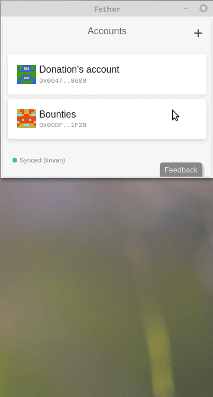
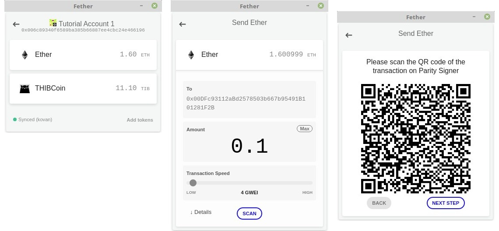
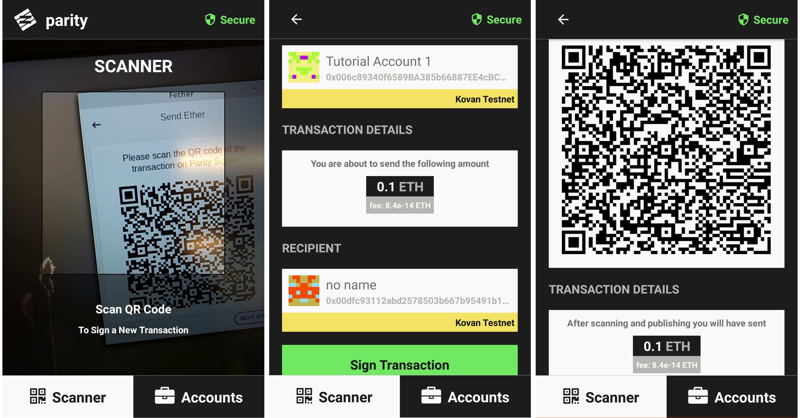
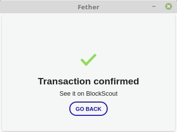

This tutorial will walk you through setting up an account with the Parity Signer Android or iOS App and then use this account together with [Parity Fether](https://github.com/paritytech/fether) to see your balance and transfer funds or ERC-20 tokens from this account.

## Summary
- [1. Get Parity Signer mobile application](#1-get-parity-signer-mobile-application)
- [2. Setup or recover an account](#2-setup-or-recover-an-account)
  - [Create an account](#create-an-account)
  - [Recover an account with your recovery phrase](#recover-an-account-with-your-recovery-phrase)
- [3. Add Parity Signer's account to Fether](#3-add-parity-signers-account-to-fether)
- [4. Sign a transaction on Fether](#4-sign-a-transaction-using-parity-fether)

## 1. Get Parity Signer mobile application

### Device security
Parity Signer is meant to be used offline. The mobile device used to run Parity Signer will hold valuable information that needs to be kept securely stored. It is therefore advised to:
- Get a separate mobile device.
- Make a factory reset.
- Enable full-disk encryption on the device, with a reasonable password (might not be on by default, for example for older Android devices).
- Do not use any biometrics such as fingerprint or face recognition for device decryption/unlocking, as those may be less secure than regular passwords.
- Once Parity Signer has been installed, enable airplane mode and make sure to switch off Wifi, Bluetooth or any connection ability of the device.
- Only charge the phone using a power outlet that is never connected to the internet. Only charge the phone with the manufacturer's charging adapter. Do not charge the phone on public USB chargers.

Please find more info [here](Parity-Signer-Mobile-App) about the Parity Signer application.

### Install Parity Signer mobile application

Install Parity Signer making sure that it originated from **Parity Technologies**
- [Android](https://play.google.com/store/apps/details?id=io.parity.signer)
- [iOS](https://itunes.apple.com/us/app/parity-signer/id1218174838)

## 2. Setup or recover an account
When launching the app for the first time, no account has been set up yet. At this stage, you will either want to create an identity (root account) directly from your mobile device or recover an identity (root account) previously created with Parity Signer or [Parity UI / Wallet](https://wiki.parity.io/Parity-Wallet) (Desktop)
 
### Create an account
 
Tap on the `Create` button after you first entered into the app, and then you can give the identity any name you like.

In the next step, your recovery phrase will be presented to you. Think of it as a master key. If you lose it, you lose your money.
**Write this recovery phrase down and store it in a safe place**.
If your phone gets stolen/broken/forgotten this will be the only way to [recover your account](#recover-an-account-with-your-recovery-phrase).

You will then be asked to choose a pin code. This pin will be needed later on to unlock your account to manage the identity or sign a transaction.

The next screen you will allow you to select a network for generating an account.

### Recover an account with your recovery phrase

If you already have an account created with either Parity Signer or any other wallet, you can recover it by doing so:
- Tap on the top right side user icon, and choose ` + Add Identity`.
- Input the new identity name and tap the `Recover Identity` button.
- Type in the recovery phrase, word suggestion helps you prevent any typo. The field will turn red if the recovery phrase is not a bip39.
- Tap `Recover Identity`.
- Select a PIN number and confirm it by typing it again.
- Once your Identity is generated, you can select a network to create your first account.

## 3. Add Parity Signer's account to Fether

To be able to follow this tutorial and send Ether from a freshly created account on Parity Signer mobile app, you will need to get some Ether on this account first. Parity Fether is a simple wallet based on a light client that will allow you to manage your Signer account seamlessly.

- [Download](https://github.com/paritytech/fether/releases), install and launch Parity Fether.
- On Fether's first screen, click the + button and then `recover an account`.
- Click `Recover from Parity Signer`, it will show the image of the webcam for you to scan the Parity Signer's account QR code.
- On Parity Signer app, select the account you want to copy the address.
- Scan the QR code displayed on your phone with your computer's webcam. Make sure the QR code is fully displayed on your mobile's screen.
- You can now name this account on Fether. Parity Signer's account will be recognizable thanks to the Parity Signer's logo next to the identicon.

### 4. Sign a transaction using Parity Fether

Assuming that your Parity Signer account now has funds, you will be able to send some Ether securely to anyone, without transferring your private key, and without needing any internet connection on your mobile phone.

- On Fether, select the account added previously and click on either Ether or the Token you want to send funds from.
- On Fether, enter the address of the account you want to send Ether or Tokens to as well as the amount of gas. Make sure to try with a small amount of Ether first before sending larger amounts.
- Click on `Scan` when you're done.

You will now be presented with a QR code that represents the transaction. Since this transaction is sending funds from your Parity Signer mobile app account, only this account (sitting on your phone) can sign and authorise this transaction. This is what we'll do in the next steps:
- From the Parity Signer mobile app, tap the scan button on the top right and scan the QR code presented by Fether.
- Review the transaction addresses and the amount to send on your phone. The amount and addresses must match what you've entered in Fether. If you got phished, this is where you can realise it and reject the transaction.
- Once you're sure, scroll down and click `Sign Transaction` to enter your pin and get the QR code of the scanned transaction.

Your phone has now *signed the transaction offline* using your Parity Signer account private key. The QR code that is now displayed on your phone represents a signed transaction that can be broadcasted. We will do this in the next steps:
- On Fether, click on `Next step`, this will turn on your webcam.
- Face your phone's display to your webcam for Fether to be able to read the signed transaction.
- Verify one last time that the account addresses are correct as well as the amount to transfer on Fether.
- Click `Send` on Fether.
- Congrats you just sent Ether from an air-gapped account :)

